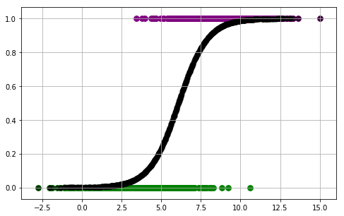

### Questions

### Objectives
YWBAT
* explain how gradient descent is used in logistic regression

### Outline
* Take Some Questions
* Discuss What Gradient Descent Does!!!!!!!
* Implement with 1d array
* Discuss how this is extrapolates to multi-dimensional arrays
* Possibly implement with higher dimensions
* SKLEARN


```python
import pandas as pd
import numpy as np

from sklearn.linear_model import LogisticRegression, LogisticRegressionCV, SGDClassifier
from sklearn.metrics import confusion_matrix, r2_score, accuracy_score, make_scorer, r2_score, precision_score, recall_score
from sklearn.model_selection import train_test_split, cross_val_score, KFold


import matplotlib.pyplot as plt
```

### Let's load in some mocked data


```python
df = pd.read_csv("data.csv")
df["x"] = x
df["y"] = y
df.head()
```


<div>
<style scoped>
    .dataframe tbody tr th:only-of-type {
        vertical-align: middle;
    }

    .dataframe tbody tr th {
        vertical-align: top;
    }

    .dataframe thead th {
        text-align: right;
    }
</style>
<table border="1" class="dataframe">
  <thead>
    <tr style="text-align: right;">
      <th></th>
      <th>x</th>
      <th>y</th>
    </tr>
  </thead>
  <tbody>
    <tr>
      <th>0</th>
      <td>10.862505</td>
      <td>1</td>
    </tr>
    <tr>
      <th>1</th>
      <td>5.067503</td>
      <td>0</td>
    </tr>
    <tr>
      <th>2</th>
      <td>9.902806</td>
      <td>1</td>
    </tr>
    <tr>
      <th>3</th>
      <td>6.249646</td>
      <td>1</td>
    </tr>
    <tr>
      <th>4</th>
      <td>5.969225</td>
      <td>0</td>
    </tr>
  </tbody>
</table>
</div>


### Plotting our points with color


```python
color_dict = {0: 'green', 1: 'purple'}
plt.figure(figsize=(8, 5))
plt.grid()
for i, j in zip(x, y):
    plt.scatter(i, j, color=color_dict[j], s=60, alpha=0.3)
plt.show()

# a value at x=0 would throw things off because both classes have x = 0
# The goal is to predict 1s and 0s using a sigmoid function 
```


### How can we optimize this function to estimate these points?  

$$f(x)= \frac{1}{1 + e^{-(\beta_0 + \beta_1 x_1 + ...)}}$$   

in our case

$$f(x)= \frac{1}{1 + e^{-(\beta_0 + \beta_1 x_1)}}$$   

$\beta_0, \beta_1$ shifts along the x-axis and change our shape

[Great Derivation of the Derivative of Sigmoid](https://towardsdatascience.com/derivative-of-the-sigmoid-function-536880cf918e)


```python
def sigmoid(x, b0=-10, b1=1):
    num = 1
    den = 1 + np.exp(-(b0 + b1*x))
    return num / den


def d_sig(x, b0=0, b1=1):
    return sigmoid(x, b0, b1) * (1 - sigmoid(x, b0, b1))
```


```python
color_dict = {0: 'green', 1: 'purple'}
plt.figure(figsize=(8, 5))
plt.grid()
for i, j in zip(x, y):
    plt.scatter(i, j, color=color_dict[j], s=60)
plt.scatter(x, y_pred, color='k', linewidth=2)
plt.show()
```


```python
def get_labels(y_pred, thresh=0.50):
    labels = []
    for pred in y_pred:
        if pred >= thresh:
            labels.append(1)
        else:
            labels.append(0)
    return labels


def get_labels2(y_probs, thresh=0.50):
    labels = []
    for pred in y_probs: # pred = [float, float]
        if pred[1] >= thresh:
            labels.append(1)
        else:
            labels.append(0)
    return labels
```


```python
# Let's visualize our loss function with respect to our b1s
plt.figure(figsize=(8, 8))
plt.grid()
plt.plot(b1s, scores, alpha=0.5)
plt.xlabel('Beta_1s')
plt.ylabel('1 - Accuracy')
plt.show()
```


```python
preds = sigmoid(x)
labels = get_labels(preds)
# 1 - accuracy_score(y, labels) 
# loss function = 1 - accuracy
# b0 = -10, b1 = 1, 0.366


# Find b0 and b1 that minimizes are loss function
# for the sake of simplicity we're going  to hold b0 = -10

b0s = np.linspace(-20, 20, 100)
b1s = np.linspace(-20, 20, 100)

loss_function = lambda y, labels: 1 - accuracy_score(y, labels)

# let's just do a loop to find the best b1 for our b0 = -10

scores = []
for b0 in b0s:
    for b1 in b1s:
        preds = sigmoid(x, b0=b0, b1=b1)
        labels = get_labels(preds)
        loss = loss_function(y, labels)
        scores.append(loss)
        scores.append([b0, b1, loss])
```


```python
scores = scores[1::2]
scores = sorted(scores, key = lambda x: x[2])
scores[:20]
```


    [[-13.93939393939394, 2.2222222222222214, 0.08499999999999996],
     [-19.19191919191919, 3.030303030303031, 0.08699999999999997],
     [-8.686868686868687, 1.4141414141414153, 0.08699999999999997],
     [-20.0, 3.030303030303031, 0.08999999999999997],
     [-14.343434343434343, 2.2222222222222214, 0.09099999999999997],
     [-14.747474747474747, 2.2222222222222214, 0.09199999999999997],
     [-8.282828282828284, 1.4141414141414153, 0.09399999999999997],
     [-12.727272727272727, 2.2222222222222214, 0.09499999999999997],
     [-17.171717171717173, 3.030303030303031, 0.09599999999999997],
     [-3.434343434343436, 0.6060606060606055, 0.09599999999999997],
     [-12.323232323232324, 2.2222222222222214, 0.09699999999999998],
     [-15.555555555555555, 2.2222222222222214, 0.09799999999999998],
     [-4.242424242424242, 0.6060606060606055, 0.09799999999999998],
     [-15.959595959595958, 2.2222222222222214, 0.10399999999999998],
     [-11.919191919191919, 2.2222222222222214, 0.10799999999999998],
     [-7.474747474747476, 1.4141414141414153, 0.11199999999999999],
     [-16.363636363636363, 2.2222222222222214, 0.11399999999999999],
     [-11.515151515151516, 2.2222222222222214, 0.122],
     [-15.555555555555555, 3.030303030303031, 0.123],
     [-10.707070707070708, 1.4141414141414153, 0.125]]


### Estimating b0 and b1 using sklearn logisticregression


```python
xtrain, xtest, ytrain, ytest = train_test_split(x, y, train_size=0.80)
```

    /anaconda3/lib/python3.7/site-packages/sklearn/model_selection/_split.py:2179: FutureWarning: From version 0.21, test_size will always complement train_size unless both are specified.
      FutureWarning)


```python
logreg = LogisticRegression()
```


```python
logreg.fit(xtrain, ytrain)
```

    /anaconda3/lib/python3.7/site-packages/sklearn/linear_model/logistic.py:433: FutureWarning: Default solver will be changed to 'lbfgs' in 0.22. Specify a solver to silence this warning.
      FutureWarning)


    LogisticRegression(C=1.0, class_weight=None, dual=False, fit_intercept=True,
              intercept_scaling=1, max_iter=100, multi_class='warn',
              n_jobs=None, penalty='l2', random_state=None, solver='warn',
              tol=0.0001, verbose=0, warm_start=False)


```python
logreg.coef_, logreg.intercept_
```


    (array([[1.09969695]]), array([-6.72057185]))


```python
# let's visualize this 
y_pred = sigmoid(x, b0=-6.7, b1=1.1)
color_dict = {0: 'green', 1: 'purple'}
plt.figure(figsize=(8, 5))
plt.grid()
for i, j in zip(x, y):
    plt.scatter(i, j, color=color_dict[j], s=60)
plt.scatter(x, y_pred, color='k', linewidth=2, alpha=0.5)
plt.show()
```





### Estimating b0 and b1 using sgdclassifier


```python
logreg = SGDClassifier(loss='log')
logreg.fit(xtrain, ytrain)
```

    /anaconda3/lib/python3.7/site-packages/sklearn/linear_model/stochastic_gradient.py:166: FutureWarning: max_iter and tol parameters have been added in SGDClassifier in 0.19. If both are left unset, they default to max_iter=5 and tol=None. If tol is not None, max_iter defaults to max_iter=1000. From 0.21, default max_iter will be 1000, and default tol will be 1e-3.
      FutureWarning)


    SGDClassifier(alpha=0.0001, average=False, class_weight=None,
           early_stopping=False, epsilon=0.1, eta0=0.0, fit_intercept=True,
           l1_ratio=0.15, learning_rate='optimal', loss='log', max_iter=None,
           n_iter=None, n_iter_no_change=5, n_jobs=None, penalty='l2',
           power_t=0.5, random_state=None, shuffle=True, tol=None,
           validation_fraction=0.1, verbose=0, warm_start=False)


```python
logreg.coef_, logreg.intercept_
```


    (array([[45.25592497]]), array([-339.69059294]))


```python
# let's visualize this 
y_pred = sigmoid(x, b0=-340, b1=45)
color_dict = {0: 'green', 1: 'purple'}
plt.figure(figsize=(8, 5))
plt.grid()
for i, j in zip(x, y):
    plt.scatter(i, j, color=color_dict[j], s=60)
plt.scatter(x, y_pred, color='k', linewidth=2)
plt.show()
```


# Gradient Descent Key Takeaways
* Minimizing a loss function that you choose 
    * sklearn - SGDClassifer 'log' -> logistic regression
* Derivates are used to determine which direction to step in
    * If positive derivative step towards the 'center' from the right
    * If negative derivative step towards the 'center' from the left
* learning rates really matter because it determines how much of the step you take $b1 -= learning_rate*derivative$
    * 1.0 -> taking the entire step, probably too big
        * If it's too big you never find the center
    * Most common learning rates are
        * 0.1 -> take a tenth of that derivative step
        * 0.05 -> 
        * 0.01
        * 0.001
        * 0.0001 -> efficiency is terrible with these small step sizes
    * Parametrization (penalties)
        * l2 is most common
* Regular Gradient Descent
    * Pros - super efficient
    * Cons - super innacurate -> fall into first well you encounter, did you start correctly?
* Stochastic Gradient Descent 
    * Pros - Super accurate -> throw out a normal distribution (or some random distribution) of starting points
    * Cons - Inefficient and you might fall into a local minimum and not global


```python
### Cross Validation with SKlearn
```


```python
logreg = LogisticRegressionCV(verbose=10)
```


```python
logreg.fit(xtrain, ytrain)
```

    /anaconda3/lib/python3.7/site-packages/sklearn/model_selection/_split.py:2053: FutureWarning: You should specify a value for 'cv' instead of relying on the default value. The default value will change from 3 to 5 in version 0.22.
      warnings.warn(CV_WARNING, FutureWarning)
    [Parallel(n_jobs=1)]: Using backend SequentialBackend with 1 concurrent workers.
    [Parallel(n_jobs=1)]: Done   1 out of   1 | elapsed:    0.1s remaining:    0.0s
    [Parallel(n_jobs=1)]: Done   2 out of   2 | elapsed:    0.2s remaining:    0.0s
    [Parallel(n_jobs=1)]: Done   3 out of   3 | elapsed:    0.2s remaining:    0.0s
    [Parallel(n_jobs=1)]: Done   3 out of   3 | elapsed:    0.2s finished


    LogisticRegressionCV(Cs=10, class_weight=None, cv='warn', dual=False,
               fit_intercept=True, intercept_scaling=1.0, max_iter=100,
               multi_class='warn', n_jobs=None, penalty='l2',
               random_state=None, refit=True, scoring=None, solver='lbfgs',
               tol=0.0001, verbose=10)


```python
logreg.coef_, logreg.intercept_
```


    (array([[0.08946304]]), array([-0.54310658]))


```python
### Using CV score

logreg = LogisticRegression()
cross_val_score(logreg, x, y, cv=8, scoring=make_scorer(recall_score))
```

    /anaconda3/lib/python3.7/site-packages/sklearn/linear_model/logistic.py:433: FutureWarning: Default solver will be changed to 'lbfgs' in 0.22. Specify a solver to silence this warning.
      FutureWarning)
    /anaconda3/lib/python3.7/site-packages/sklearn/linear_model/logistic.py:433: FutureWarning: Default solver will be changed to 'lbfgs' in 0.22. Specify a solver to silence this warning.
      FutureWarning)
    /anaconda3/lib/python3.7/site-packages/sklearn/linear_model/logistic.py:433: FutureWarning: Default solver will be changed to 'lbfgs' in 0.22. Specify a solver to silence this warning.
      FutureWarning)
    /anaconda3/lib/python3.7/site-packages/sklearn/linear_model/logistic.py:433: FutureWarning: Default solver will be changed to 'lbfgs' in 0.22. Specify a solver to silence this warning.
      FutureWarning)
    /anaconda3/lib/python3.7/site-packages/sklearn/linear_model/logistic.py:433: FutureWarning: Default solver will be changed to 'lbfgs' in 0.22. Specify a solver to silence this warning.
      FutureWarning)
    /anaconda3/lib/python3.7/site-packages/sklearn/linear_model/logistic.py:433: FutureWarning: Default solver will be changed to 'lbfgs' in 0.22. Specify a solver to silence this warning.
      FutureWarning)
    /anaconda3/lib/python3.7/site-packages/sklearn/linear_model/logistic.py:433: FutureWarning: Default solver will be changed to 'lbfgs' in 0.22. Specify a solver to silence this warning.
      FutureWarning)
    /anaconda3/lib/python3.7/site-packages/sklearn/linear_model/logistic.py:433: FutureWarning: Default solver will be changed to 'lbfgs' in 0.22. Specify a solver to silence this warning.
      FutureWarning)


    array([0.96825397, 0.92063492, 0.95238095, 0.9047619 , 0.87096774,
           0.9516129 , 0.9516129 , 0.85483871])


### What did we learn?
* Be aware of gradient descent to not just find local but to find global minimums
* 1 - Accuracy is an acceptable loss function
* error and how it contributes to our score
* penalty terms l1 and l2 (regularization parameters) -> regulate the number/size of your parameters in model
* step size is crucial and has best practices

### Further Questions
* How do you find best parameters and model with them
